# Guide how to build your own secure pico box

This guide is from start to finish how i went about building the box and some the issues i came across as well as helpful tips. Professionally i am landscape gardener so building side was easy but i did do a couple mistakes along the process building as its something i have never done.

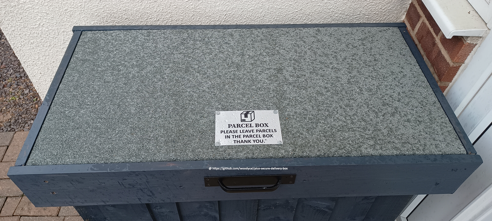

## Step 1 Building the frames
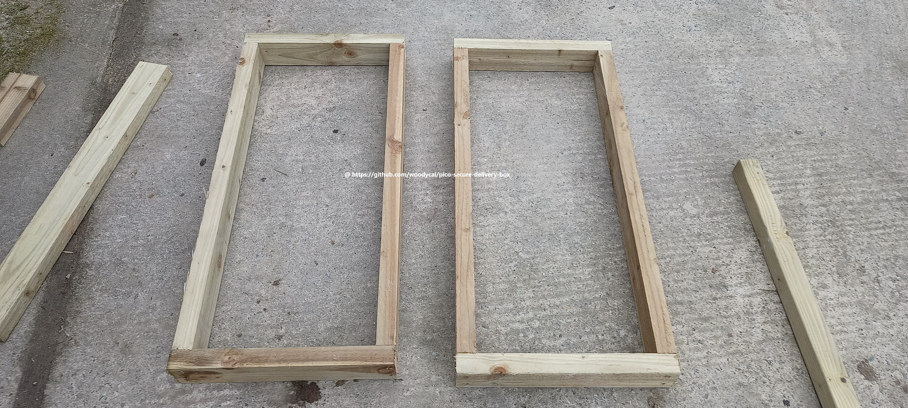 
At this stage you will need to build two frame exactly the same size as these will be used to build the main box. You will also need a third frame for the lid (top). At this point you must decide if your going to partition the box so that you have multiple lids and bays if your likely multiple deliverys a day. This will also need more drop bolt locks and door sensors as well as more coding.

## Step 2 Install frames together
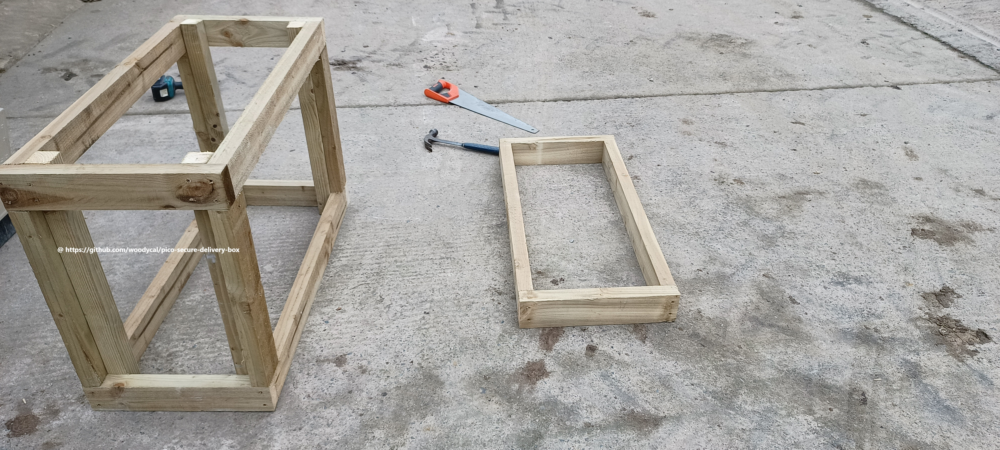
This stage is connecting the frames together so that they form a box. As you may notice the third frame is for the lid.

## Step 3 Install flooring support
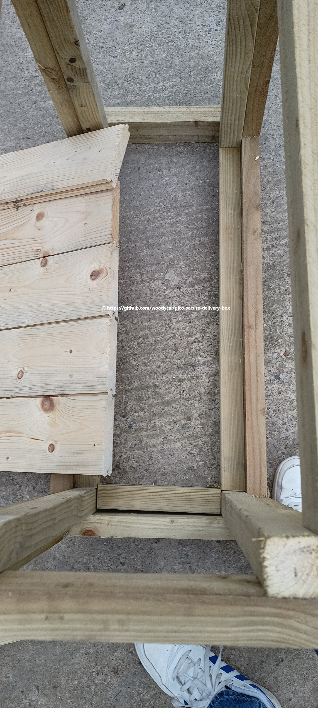
During this stage you will need to attach some smaller lengths and thickness of wood and add to the inside of the bottom frame so that you can screw or nail down in my case tongue and groove boards.

## Step 4 nailing tongue and groove boards.
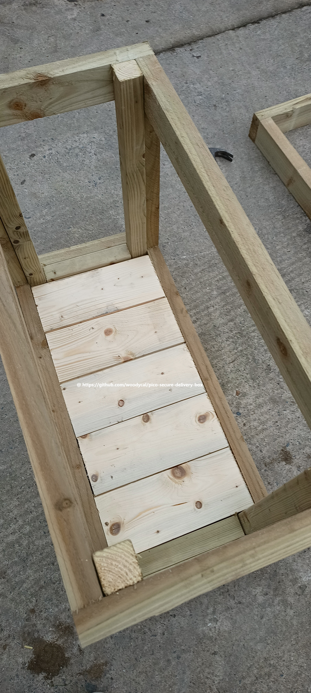
Title self explanatory i used tongue and groove boards as i build this box from spares but you can use plywood board or some other type board thats somewhat waterproof/splashproof.

## Step 5 Install cladding
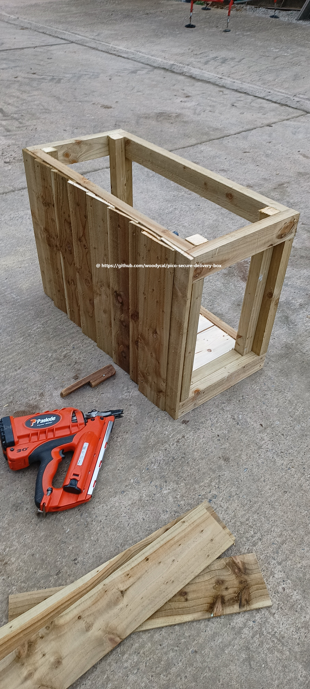
VERY IMPORTANT! While i have put the cladding on vertically as my box is under a porch if you decide to use featheredge boards make sure they are put on HORIZONTAL starting from bottom working your way up. Reason for this is driving rain can get through into the box if you live in country with alot rain like i do (uk). Also dont clad the back of the box until you install hidges and top!.Theirs massive amount cladding options out their from tongue and grove boards to composite cladding.

Make sure if you go down a wooden route you use ring shank nails as wood when it gets wet expands and contracts when it drys out which can if you use non ring shank nails will make the boards pop off / loose over time. Its also not adviseable to use screws as it makes it easy access to the box.

## Step 6 Install hinges
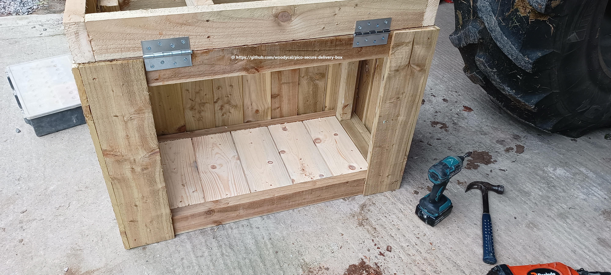
This is the point you install the hinges and top and if you were like me and got carried away cladding the whole box your have to take back of the cladding off!!! WASNT EASY not the way i cladded it on!.

## Step 7 Finish the cladding
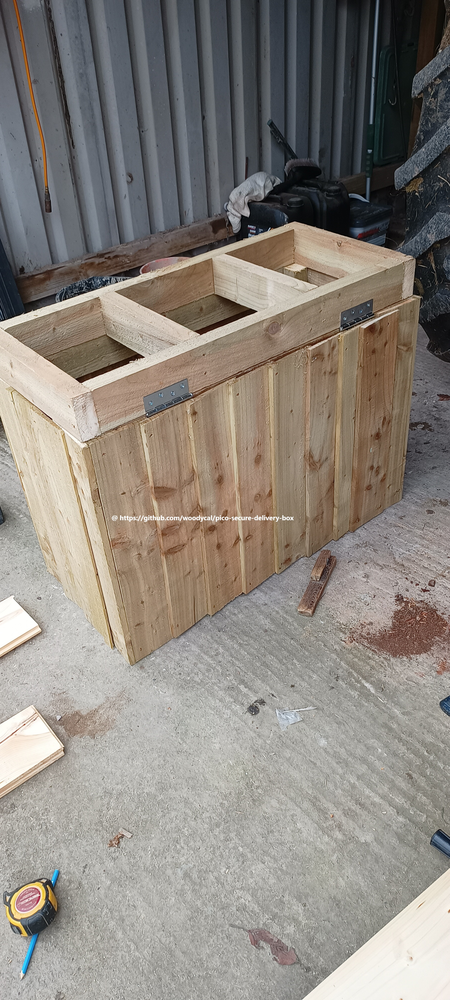
This is where you finish the cladding off on the back making sure to cover up the hidge screws on bottom section of the hidge but also making sure its not too high that it stops your lid opening. Remeber we dont want the top to open to far back so if delievery driver leaves it it doesnt spring back shut. I used standard door hindges for this.

## Step 8 Cladding top and paint
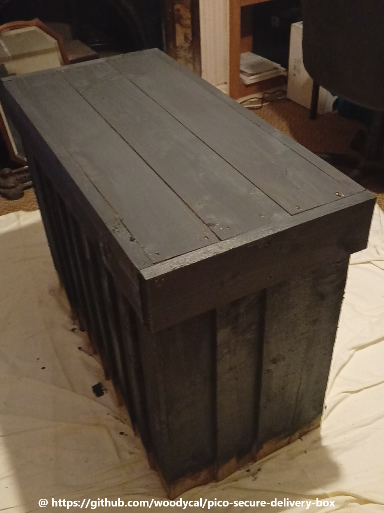
For the top i used once again tongue and groove boards then i went round the edges cladding so that the felt has got nice smooth area to nail to but also to cover up the screws on top part hindges. During this stage you can use any type board mdf or plywood sheets as this section will be felted.

## Step 9 Cutting the felt
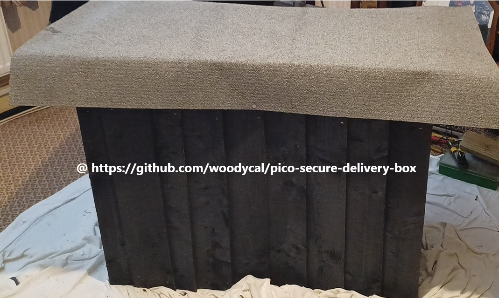
Measure felt out so that it covers the top as well as the side cladding.

## Step 10 Nailing felt and folding
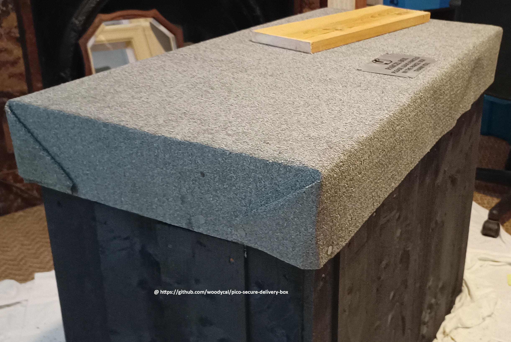

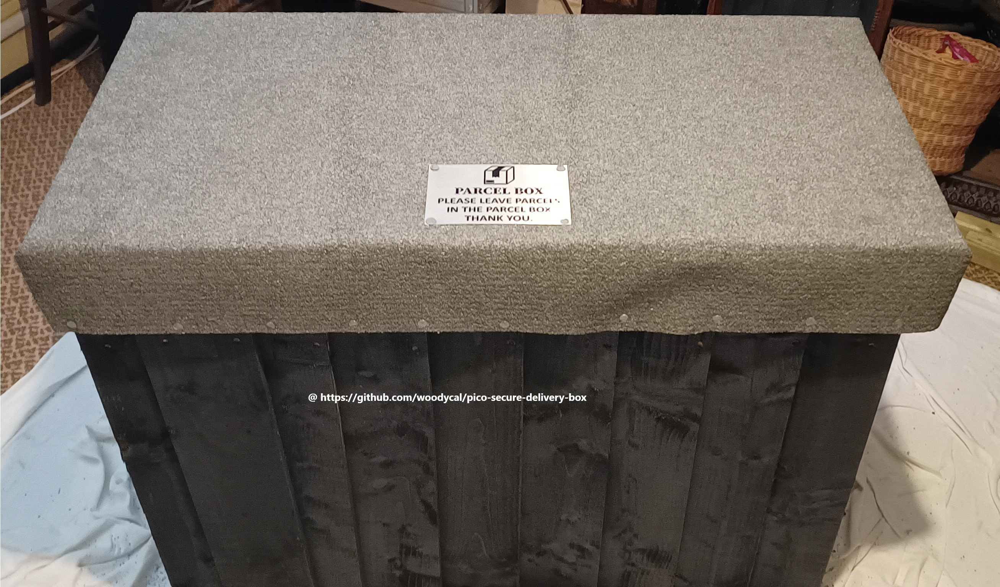

This stage can be tricky to do if weather is cold like it was in uk when i did this as felt isnt very bendy during cold temperatures and is likely to rip when folding hence why i brought this inside. Make sure you keep the felt taught as possible to reduce bubbling. Bubbling your see on second picture front but it doesnt matter to much around sides as we will clad these again which will cover them up plus the folds.

