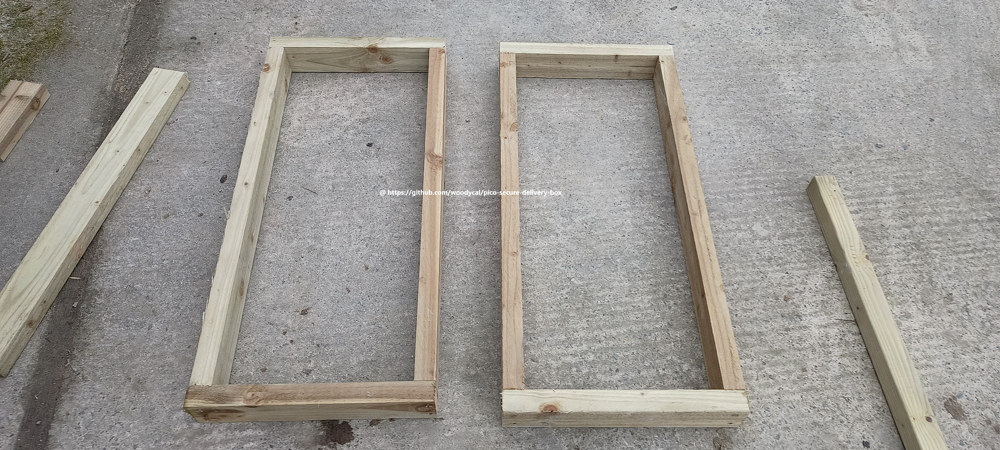

# Guide how to build your own secure pico box

This guide is from start to finish how i went about building the box and some the issues i came across as well as helpful tips. Professionally i am landscape gardener so building side was easy but i did do a couple mistakes along the process building as its something i have never done.

## Step 1 Building the frames
 

