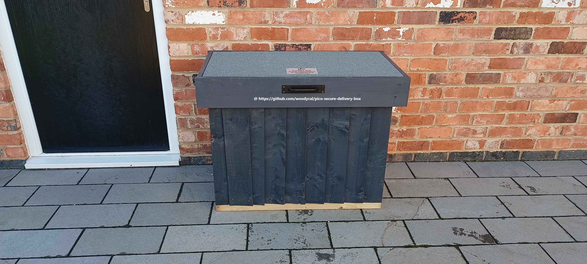
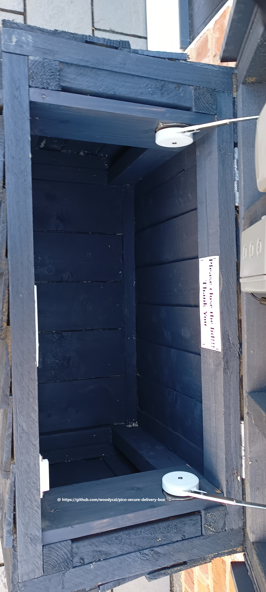
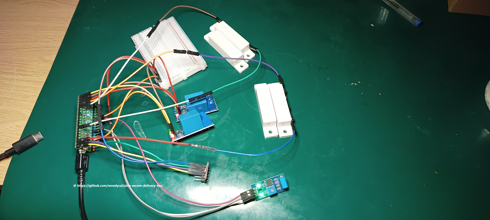

# Guide how to build your own secure pico box

This guide is from start to finish how I went about building the box and issues that came across as well as helpful tips. Professionally, I am a landscape gardener, so the building side was easyish, but I did make a couple of mistakes along the process of building, as it's something I have never done before.

## Step 1 Building the frames
 
At this stage you will need to build two frames exactly the same size as these will be used to build the main box. You will also need a third frame for the lid (top). At this point you must decide if your going to partition the box so that you have multiple lids and bays if your likely to have multiple deliverys a day. This will also need more drop bolt locks and door sensors as well as more coding.

## Step 2 Install frames together

This stage is connecting the frames together so that they form a box. As you may notice, the third frame is for the lid.

## Step 3 Install flooring support

During this stage you will need to attach some smaller lengths and thicknesses of wood and add them to the inside of the bottom frame so that you can screw or nail down, in my case, tongue and groove boards.

## Step 4 nailing tongue and groove boards.

Title self-explanatory I used tongue and groove boards as I built this box from spares, but you can use plywood board or some other type of board that's somewhat waterproof/splashproof.

## Step 5 Install cladding

VERY IMPORTANT! While I have put the cladding on vertically as my box is under a porch, if you decide to use featheredge boards, make sure they are put on HORIZONTALLY, starting from the bottom and working your way up. The reason for this is that driving rain can get through into the box if you live in a country with a lot of rain like I do (UK). Also, don't clad the back of the box until you install the hinges and lid!. There is a massive amount of cladding options out there, from tongue and groove boards to composite cladding, etc.

Make sure if you go down a wooden route, you use ring shank nails, as wood, when it gets wet, expands and contracts. which, if you use non-ring shank nails, will make the boards pop off or loosen over time. It's also not advisable to use screws, as it makes it easier to access the box.

## Step 6 Install hinges

This is the point you install the hinges and top, and if you were like me and got carried away cladding the whole box, you have to take the back of the cladding off!!! WASN'T EASY, not the way I cladded it on!.

## Step 7 Finish the cladding

This is where you finish the cladding off on the back, making sure to cover up the hinge screws on the bottom section of the hinge but also making sure it's not too high that it stops your lid from opening. Remember, we don't want the top to open too far back, so if the delivery driver leaves it open, it doesn't spring back shut. I used standard door hinges for this.

## Step 8 Cladding top and paint

For the top, I used once again tongue and groove boards, then I cladded round the edges so that the felt has got a nice smooth area to nail to but also to cover up the screws on the top part hinges at the back. During this stage you can use any type of board, MDF, or plywood sheets, as this section will be felted.

## Step 9 Cutting the felt

Measure felt out so that it covers the top as well as the side cladding.

## Step 10 Nailing felt and folding

This stage can be tricky to do if the weather is cold like it was in the UK when I did this. Felt isn't very bendy during cold temperatures and is likely to rip when folding it, hence why I brought this inside. Make sure you keep the felt as taut as possible to reduce bubbling. Bubbling your see on the second picture front, but it doesn't matter too much around the sides as we will clad these again, which will cover them up, plus the folds.

## Step 11 Installing Electric Drop Bolt Lock 12v

This stage can be tricky depending on the type of lock you get. I got an electric drop bolt lock, 12V, from Amazon, which came in two parts. [Amazon link](https://www.amazon.co.uk/LIBO-Electric-Electronic-Control-Security/dp/B07DW17J3Q/ref=sr_1_3?crid=3IMLO5TY7DW8C&dib=eyJ2IjoiMSJ9.hp2-itwyPUYHBJkAGXtzGxl7cBORglDBRUbYQpckPmc9WOuCHS1eXhC6ao8Yo6jCnItKoFeXaxsLDI9x0FOoczluv7sMgIcYGWtJ3Rzg98wND53W8JTD2CmEj2bEbKm1wl87hja0fNYtyToEtqWZSImI0eUMZtIWXg78s6UZm0SwW9PhYKXOubZoEPymGDgl2R3VeDV7jQN-EwN_8hxK6gqQQD8cuNf6WY_5Svq2c-ml-kG4rfwiejUSuTVRsCRkVPt7G3zcD3Eg0r-zuU_sxQHwqYaZiab0ZEOYoB-1H33oisJFurZfUgSz7PWrY2VXm-xuJ9r13BwGC7LCZtCJ5Q-tbDGtYkTdPOawtP_ydbUOnxM0t7EHgJyOKrLL1HeH2t3r9AjHXSWdzG3ewiGYn5-CPKJAPxeEOVc4tHjU0SD-H-a1pew6RCmiIraZKoqn.DI0taTb2DdbJ4WJ4xTMYhRsks2dMf-DbFepCZLddo_4&dib_tag=se&keywords=Electronic+dropbolt+lock+12v&qid=1737649583&sprefix=electronic+dropbolt+lock+12v%2Caps%2C76&sr=8-3). I installed an extra piece of wood so the electronic part of the lock is set back and screwed on.

I took the second part of the lock apart to use the plate because the lock doesn't work without the magnet in place. I screwed this on to the box and drilled out the hole so the drop bolt can extend into the frame.

I've tested this lock; it's insanely strong. Also note it comes with 4 wires, but in the instructions only power works, so the yellow and white wires are redundant.

## Step 12 Test your setup

Test your setup before installing. Amount errors I found with hardware, for instance, the BME280 sensor, I originally had this in a breadboard and it wouldn't work. I kept getting EIO errors, yet wired directly, it was fine, so it's worth testing before you install it in the box. It's also worth testing out the vibration sensor because mine wasn't sensitive enough, so by adjusting the screw on the sensor, I found the sweet spot.

## Step 13 Install pico and sensors

This is the stage you install waterproof boxes and install pico and sensors around the box. I installed the bulk of mine in the lid because it has fewer wires interfering with moving parts as well as leaves more room in the bottom box for parcels. I decided to use a 12V battery because originally I was going to solar panel the top, but the way the UK is for sunshine in winter, it wouldn't really work. You can also use mains supply using something like a 12V power supply. That's something I might end up doing once I see how long this 12V 5Ah battery lasts. Still testing as I write this.

The drop bolt lock and siren work from a 12V supply, using the relays to control these circuits. Make sure you wire these circuits up so that 1. If your pico loses power, it releases the drop bolt lock. 2. If your pico loses power, the siren activates. Getting these wrong could leave you with a locked box and no way in!

Powering the pico, I got 12V to 5V DC to DC converter, which is on its own circuit to the 12V battery.

Here is the layout. At this stage, you can also do finishing touches like installing a handle and setting up a soft-close lid hinge to reduce slamming/shaking, lid rattling, and loose wires. Having the soft-close lid hinge also stops them from opening the box right up or leaning it against a wall and not closing it. It's also worth considering using anchor bolts of some kind so people don't actually take the whole box.
