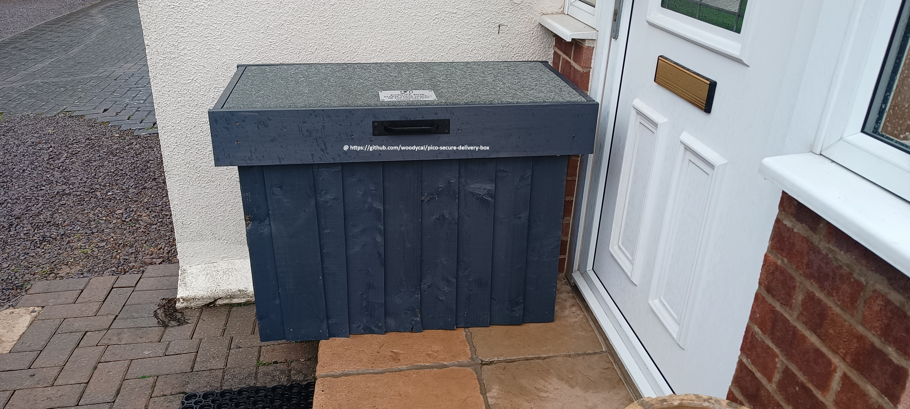
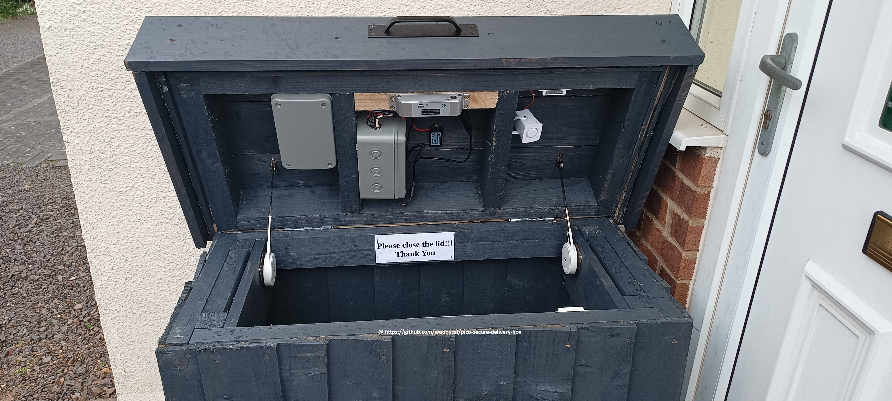

# Pico Secure Delivery Box

Please note I'm not professional programmer im a beginner hobbyist!. Designed to be simple and easy to understand with alot potential to grow.

## Item list:

### Pico w or Pico 2w (Needs WiFi)
### 2 relay modules
### 1 SW 420 vibration sensor
### 1 BME 280 Temperature, Pressure, Humidity sensor
### 2 Magnetic Door Contact Reed Switchs
### 1 12v Electric Drop Bolt Lock
### 12v siren
### 12v battery

Software: Micropython version 1.25.0 (https://micropython.org/resources/firmware/RPI_PICO2_W-20250119-v1.25.0-preview.217.gb4f53a0e5.uf2) and thonny for uploading the following files to Pico (main.py and bme280.py)

## INSTRUCTIONS

Before you upload main.py make sure you change in main.py the WiFi credentials to your home network ssid and password and any variations in the pin outs etc.
### Upload
main.py
BME280.py

## The Modes

### ARMED: This mode arms the box which locks it and goes into protection mode so if either box sensors tripped or their is a maximum of 6 vibrations counted this will activate the siren.

### DISARMED: This mode deactivates all sensors as well as releasing the lock to open the box.

### DROPOFFMODE: This mode starts off unlocked but once the box sensor is tripped (box opened) it starts a countdown 3 mins after which it goes into armed mode so locks the box and activates sensors/vibration sensor. if either are tripped siren activates.

## How to control the box

This is all done through web browser while connected to your local internet.

If you need outside access ie not on home network I would advise a secure VPN of some kind to access your home network. This wasn't designed for being open to internet as I block my iot devices from internet.

Detailed guide how to build your own secure delievery box from scratch [Click here](Building-box/README.md)
