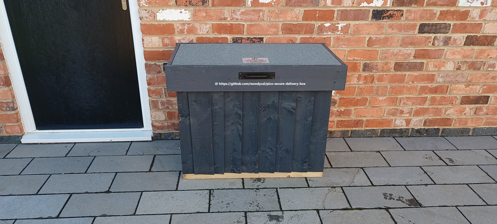
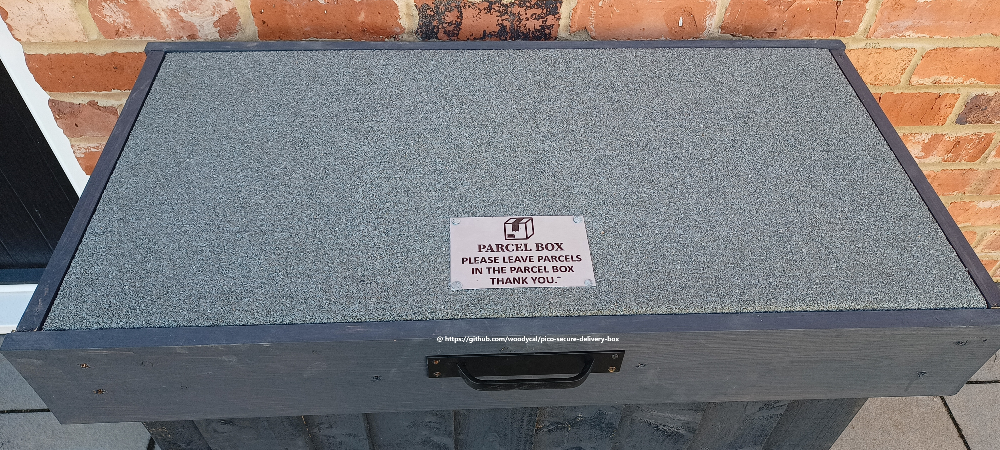
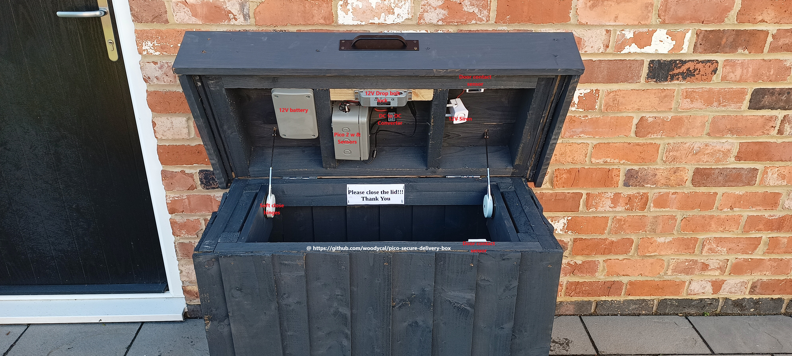
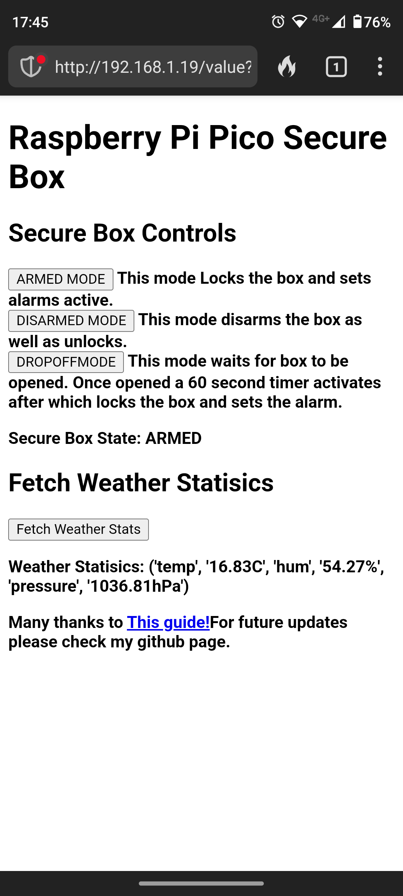

# Pico Secure Delivery Box

Please note I'm not a professional programmer -  I'm a beginner hobbyist! This is designed to be simple and easy to understand with potential to grow. I originally wanted cameras and a keypad, but realistically delivery drivers just want to drop your parcel off as quickly as possible, so a drop box is more realistic. I will be implementing a schedule in future updates.

## Item list:

### Raspberry Pi Pico W or Pico 2W (Needs WiFi)

### 2x Relay modules

### 1x SW 420 vibration sensor

### 1x BME 280 Temperature, Pressure, Humidity Sensor

### 2x Magnetic Door Contact Reed Switches

### 1x 12V Electric Drop Bolt Lock

### 1x 12V Siren

### 1x 12V Battery or power supply

Software: Micropython version 1.25.0 (https://micropython.org/resources/firmware/RPI_PICO2_W-20250119-v1.25.0-preview.217.gb4f53a0e5.uf2) and Thonny for uploading the following files to the Pico (main.py and bme280.py)

## INSTRUCTIONS

Before you upload main.py, make sure you change the WiFi credentials and any variations in the pinouts, etc in main.py.

### Upload
main.py

BME280.py

## The Modes

### ARMED: This mode arms the box, which locks it and goes into protection mode, so if either box sensor is activated or there is a maximum of 6 vibrations counted, this will activate the siren.

### DISARMED: This mode deactivates all sensors as well as releases the lock to open the box. If someone unplugged Pico, they are going to get a loud surprise if wired correctly.

### DROPOFFMODE: This mode starts off unlocked, but once the box sensor is tripped (box opened), it starts a countdown of 3 mins (180 secs), after which it goes into armed mode, so it locks the box and activates sensors.

## How to control the box:

This is all done through a web browser while connected to your local internet.

If you need outside access, i.e. not on a home network, I would advise a secure VPN of some kind to access your home network. This wasn't designed for being open to the internet, as I block my IoT devices from the internet but can use them locally.

Detailed guide on how to build your own secure delivery box from scratch [Click here](Building-box/README.md)
