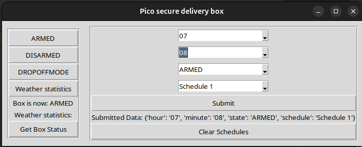

# Pico Secure Delivery Box

Please note I'm not a professional programmer -  I'm a beginner hobbyist! This is designed to be simple and easy to understand with potential to grow. I originally wanted cameras and a keypad, but realistically delivery drivers just want to drop your parcel off as quickly as possible, so a drop box is more realistic. I have for now implemented schedule functions into a tkinter app please refer their if its a function you need. Reason for this is that i already have an alarm system setup in tkinter for some barns quite far away from the house with a client server communication.

Detailed guide how to use tkinter client [Click here](picotkinter/README.md)

Detailed guide on how to build your own secure delivery box from scratch [Click here](Building-box/README.md)

## Item list:

### Raspberry Pi Pico W or Pico 2W (Needs WiFi)

### 2x Relay modules

### 1x SW 420 vibration sensor

### 1x BME 280 Temperature, Pressure, Humidity Sensor

### 2x Magnetic Door Contact Reed Switches

### 1x 12V Electric Drop Bolt Lock

### 1x 12V Siren

### 1x 12V Battery or power supply

Software: Micropython version 1.25.0 (https://micropython.org/download/RPI_PICO2_W/) and Thonny for uploading the following files to the Pico (main.py and bme280.py)

## INSTRUCTIONS

Before you upload main.py, make sure you change the WiFi credentials and any variations in the pinouts, etc in main.py.

### Upload
main.py

BME280.py

## The Modes

### ARMED: This mode arms the box, which locks it and goes into protection mode, so if either box sensor is activated or there is a maximum of 6 vibrations counted, this will activate the siren.

### DISARMED: This mode deactivates all sensors as well as releases the lock to open the box. If someone unplugged Pico, they are going to get a loud surprise if wired correctly.

### DROPOFFMODE: This mode starts off unlocked, but once the box sensor is tripped (box opened), it starts a countdown of 3 mins (180 secs), after which it goes into armed mode, so it locks the box and activates sensors.

## How to control the box 2 ways:

You can use server web hosting.

Or can use tkinter app which is a client and server communication which has schedule.

I have tested both the options above combined and it does work running two servers from Pico w but for GitHub I think it's best we keep them separate.

## Outside access
Now that I have created tkinter app you can run a vnc server and control it that way. With vnc you can log into server from alot or devices anywhere, If correctly setup!.

If you prefer the web server setup you will have to use a VPN of some kind to to access your home network(something like wireguard).